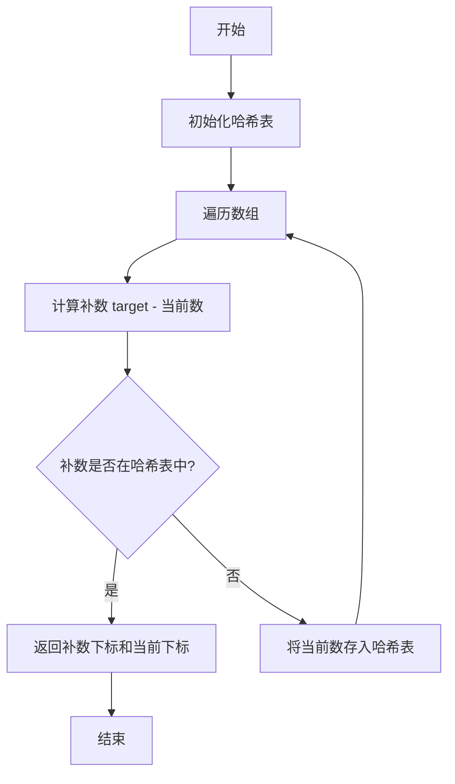

# 两数之和（基础）学习记录

### 一、基础信息

- 题目：两数之和（基础）
- 难度：简单
- 学习进度：[2/4] ⭐⭐⭐
   首次：2024-10-30
   1⃣  +1天    2024-10-31 √
   2⃣  +2天    2024-11-02 
   3⃣  +4天    2024-11-06 
   4⃣  +15天   2024-11-21
- 下次复习： 2024-11-02 

### 二、题目要点提取

1. 核心约束
   - 只有一个答案
   - 每个元素只能用一次
2. 关键约束：
   - 返回数组下标而非 元素值
   - 可以按任意顺序返回答案
3. 易错点：
   - 注意同一个元素不能重复使用
   - 需要返回的是下标而不是元素值
   - 需要考虑数组中可能有重复元素的情况

### 三、解题思路记录

1. 数据结构选择
   - 使用哈希表(Map/Object)存储遍历过的数字
   - 特殊存储形式：键为数字值，值为下标
   - 这种设计能够实现O(1)时间查找目标值的下标
2. 关键设计
   - 一次遍历+哈希表查找
   - 优点：
      * 时间复杂度O(n)，只需要遍历一次数组
      * 空间复杂度O(n)，需要额外的哈希表空间
      * 实现简单，易于理解
3. 算法流程图

### 四、 代码实现
   - [查看文档](twoSumBase.js)

### 五、要点与易错点
   1. 关键知识点
      - 哈希表的特殊设计：
         - 采用{值：下标}而非常见的{下标：值}形式
         - 目的是实现O(1)时间找到补数对应的下标
         - 这是算法题中”根据需求灵活调整数据结构“的典型案例
      - 时间复杂度和空间复杂度的权衡
      - JavaScript中对象作为哈希表的使用方法
   2. 易错点
      - 存入哈希表的时机：应该在找不到配对后再存入
      - 返回值的顺序：先返回较早遍历到的下标
      - 检查补数存在性时使用'in'操作符而不是直接判断值
      - 可能误用常规的哈希表形式（用下标作为键），导致无法O(1)时间找到目标值

### 六、关联记忆
   1. 类似题目
      - 三数之和
      - 四数之和
      - 两数之和II - 输入有序数组
   2. 应用场景
      - 查找配对元素的问题
      - 需要O(1)时间复杂度查找的场景
      - 空间换时间的典型案例
      - 哈希表结构灵活运用的案例
