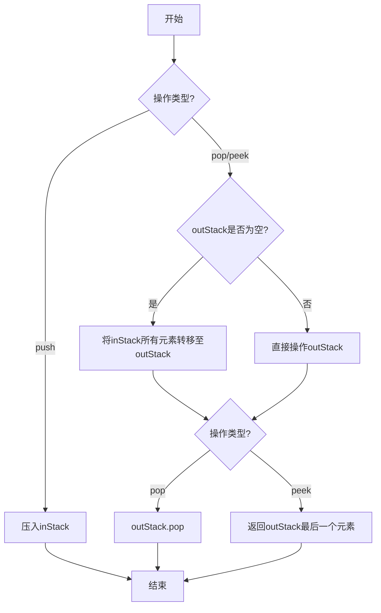

# 有效括号题解学习记录

### 一、基础信息

- 题目：用队列实现栈学习记录
- 难度：简单
- 掌握进度:[3/4] ⭐⭐⭐
   startDate： 20241023
   R1  +1 天   20241024 √
   R2  +2 天   20241026 √
   R3  +4 天   20241030 √
   R4  +15 天  20241114
- nextReview： 20241114

### 二、题目要点提取

1. 核心约束
   - 只能用栈的操作，即 push 和 pop
   - 必须实现队列的 push、pop、peek、empty 四个方法
   - 要符合队列现金显出（FIFO）的特性
2. 关键约束：
   - 不能直接使用队列相关的数据结构
   - 栈操作限制：push、pop、peek、size、isEmpty
3. 易错点：
   - 需要正确处理两个栈之间的元素转移
   - pop 和 peek 操作需要考虑两个栈的状态

### 三、解题思路记录

1. 数据结构选择
   - 使用两个栈：inStack 和 outStack
   - inStack 专门处理入队操作
   - outStack 专门处理出队和查看操作
2. 关键设计
   - 优点：
     - 通过两个栈的配合，巧妙的将 LIFO 转换为 FIFO
   - 实现要点
     - 新元素统一 push 到 inStack
     - 仅在 outStack 为空时才进行转移
     - 转移时要一次性完成所有元素的转移
3. 算法流程图

### 四、 代码实现

- [查看文档](MyQueue.js)

### 五、要点与易错点

1.  关键知识点
    - js 数组的 pop()和队列 pop 操作的区别
    - js 数组中的`pop()`方法会改变原数组
2.  易错点
    - 转移操作的时机：仅在 outStack 为空时
    - peek 操作逻辑要和 pop 保持一致，都需要考虑 outStack 的状态
    - empty 判断需要同时考虑两个栈的状态
    - 注意 this 的应用，这里的 this 是必须的

### 六、关联记忆

1.  类似题目

- 用队列实现栈（类似的数据结构转换思维）
- 有效括号（同样使用栈的特性）

2.  应用场景

- 消息队列的实现
- 任务调度系统
- 数据流处理中的缓冲区实现
