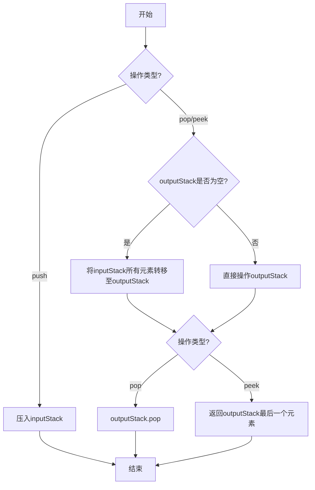

# 有效括号题解学习记录

### 一、基础信息

- 题目：用队列实现栈学习记录
- 难度：简单
- 学习进度：[1/4] ⭐⭐⭐
   首次：2024-10-23
   1⃣  +1天    2024-10-24
   2⃣  +2天    2024-10-26
   3⃣  +4天    2024-10-30
   4⃣  +15天   2024-11-14
- 下次复习：2024-10-24

### 二、题目要点提取

1. 核心约束
   - 只能用栈的操作，即push和pop
   - 必须实现队列的push、pop、peek、empty四个方法
   - 要符合队列现金显出（FIFO）的特性
2. 关键约束：
   - 不能直接使用队列香瓜你的数据结构
   - 只能使用栈的基本操作（push，pop）
3. 易错点：
   - 需要正确处理两个栈之间的元素战役实际
   - pop 和 peek 操作需要考虑两个栈的状态

### 三、解题思路记录

1. 数据结构选择
   - 使用两个栈：inputStack和outputStack
   - inputStack用于处理push操作
   - outputStack用于处理pop和peek操作
2. 关键设计
   - 优点：
      - 通过两个栈的配合，巧妙的将LIFO转换为FIFO
   - 实现要点
      - 新元素永远要push到inputStack
      - 只有再outputStack为空时才将inputStack的元素转移到outputStack
      - 转移时要将inputStack的所有元素都转移到outputStack
3. 算法流程图

### 四、 代码实现
   - [查看文档](MyQueue.js)

### 五、要点与易错点
   1. 关键知识点
      - js数组中的`pop()`和题设队列的pop含义不一样
      - js数组中的`pop()`方法会改变原数组
   2. 易错点
      - pop前需要检查outputStack是否为空，否则会不符合队列的期望
      - peek操作逻辑要和pop保持一致，都需要考虑outputStack的状态
      - empty判断需要同时考虑两个栈的状态

### 六、关联记忆
   1. 类似题目
   - 用队列实现栈（类似的数据结构转换思维）
   - 有效括号（同样使用栈的特性）
   2. 应用场景
   - 消息队列的实现
   - 任务调度系统
   - 数据流处理中的缓冲区实现

