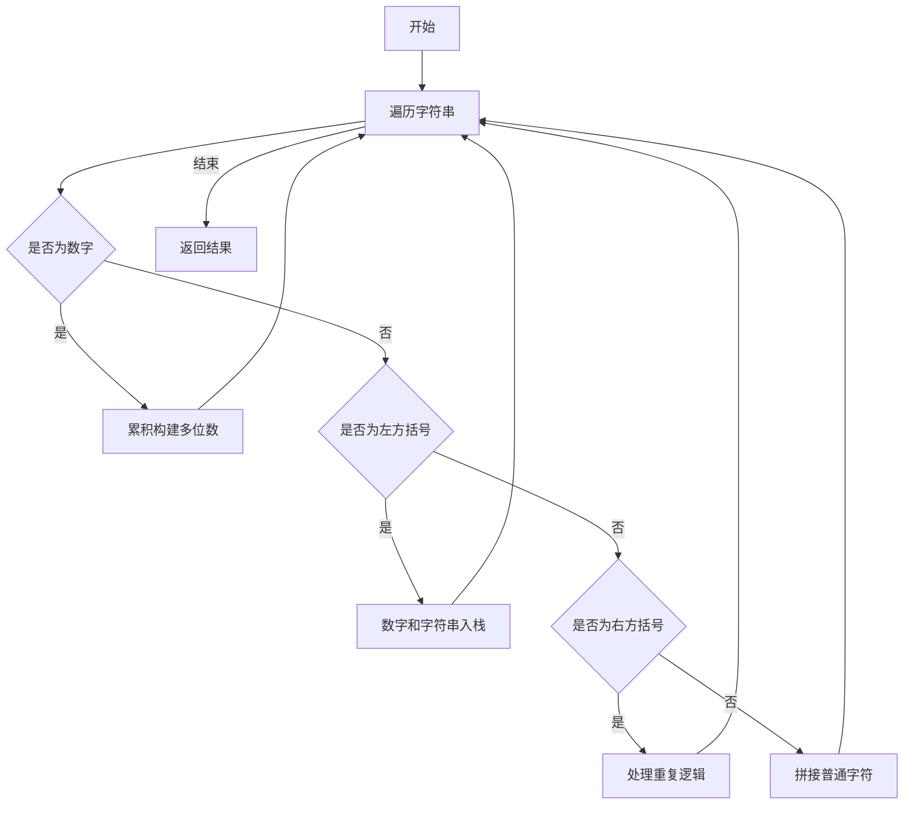

# 字符串解码学习记录

### 一、基础信息

- 题目：字符串解码
- 难度：中等
- 掌握进度:[2/4] ⭐⭐⭐
   startDate：    20241024 √
   R1    +1 天    20241025 √
   R2    +2 天    20241027 √
   R3    +4 天    20241031 √
   R4    +7 天    20241107
   R5    +15 天   20241122
- nextReview：    20241107

### 二、题目要点提取

1. 核心约束

- 输入格式为 k[encoded_string]
- k 必须是正整数
- encoded_string 可以是普通字符串或包含嵌套结构

2. 关键约束：
   - 输入字符串保证有效，无多余空格
   - 方括号格式符合要求
   - 原始数据不包含数字（数字只用于表示重复次数）
3. 易错点：
   - encoded_strting 支持嵌套结构，如 2[a2[b]]
   - k 可以是多位数字，如 12[a]
   - 字符串中可能包含非括号部分，如 ab2[c]

### 三、解题思路记录

1. 数据结构选择
   - 主要使用栈结构
   - 需要两个栈：数字栈和字符串栈
   - 需要两个临时变量：当前数字和当前字符串
2. 关键设计
   - 优点：
     - 使用栈可以天然处理嵌套结构
     - 分离数字和字符串处理逻辑
   - 实现要点：
     - 遇到数字是累计构建多位数
     - 遇到'[' 时保存当前的状态（？）
     - 遇到']'时处理重复逻辑并与上层合并
     - 普通字符串直接拼接到当前字符串
3. 算法流程图



### 四、 代码实现

- [查看文档](decodeString.js)

### 五、要点与易错点

1.  关键知识点
    - 栈的特性用于处理嵌套结构
    - 字符串的重复拼接(repeat 方法)
    - 数字的累计构建技巧
    - 状态的保存和恢复
    - 遇到左括号的处理不是清空 currentStr，而是保存并开启新的工作区
2.  易错点
    - 忘记处理多为数字
    - 嵌套结构处理：通过双栈保存状态
    - 丢失非括号内的字符串
    - 字符串拼接顺序错误
    - 栈的出入顺序处理不当
    - 需要理解两个栈内值的对应关系和意义

### 六、关联记忆

1.  类似题目

- 括号匹配问题
- 表达式计算问题
- 嵌套结构解析问题

2.  应用场景

- 模板引擎中的循环结构解析
- 代码格式化工具的实现
- 文本压缩算法的解码过程

```

```
