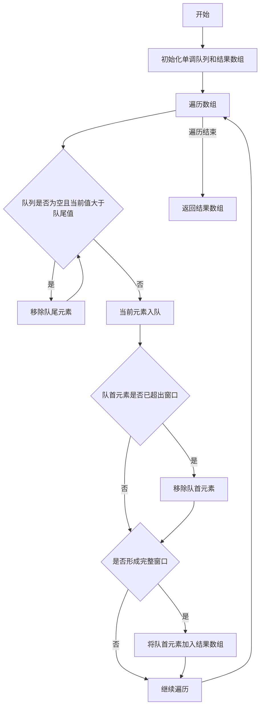

# 滑动窗口最大值学习记录

### 一、基础信息

- 题目：滑动窗口最大值
- 难度：困难
- 学习进度：[1/4] ⭐⭐⭐
  首次：2024-10-26
  1⃣ +1 天 2024-10-27
  2⃣ +2 天 2024-10-29
  3⃣ +4 天 2024-11-02
  4⃣ +15 天 2024-11-17
- 下次复习：2024-10-27

### 二、题目要点提取

1. 核心约束

- 窗口大小固定为 K
- 窗口只能向右移动
- 每次仅移动一位
- 必须返回每个窗口的最大值

2. 关键约束：
   - 数组长度可能大于窗口大小 k
   - 需要处理数组为空或者 k=1 的边界情况
3. 易错点：
   - 未处理窗口内最大值离开窗口的情况
   - 未正确维护最大值更新
   - 忽略了边界条件的处理

### 三、解题思路记录

1. 数据结构选择
   - 使用双端队列而不是普通队列
   - 队列中存储元素的索引而不是值
   - 保持队列单调递减
   - 只存储"有可能成为最大值"的索引
2. 关键设计
   - 优点：
     - 队列最大长度不超过窗口大小
     - 通过存储索引可以方便判断元素是否过期
     - 自动舍弃了那些"永远不可能成为最大值"的元素
   - 实现要点：
     - 维护队列单调递减性质
     - 即使移除过期元素（超出窗口范围）
     - 新元素入队前清理小于它的所有元素
3. 算法流程图

### 四、 代码实现

- [查看文档](maxSlidingWindow.js)

### 五、要点与易错点

1.  关键知识点
    - 双端队列的特性和使用场景
    - 单调队列的维护方法
    - 通过索引判断元素是否过期
2.  易错点
    - 忘记处理队列中的过期元素
    - 队列中存储值而不是索引
    - 未正确维护单调性质

### 六、关联记忆

1.  类似题目

- 滑动窗口最小值
- 单调栈相关题目
- 队列实现栈
- 最大队列实现

2.  应用场景

- 股票价格监控系统
- 网络流量监控
- 系统负载监控
- 时间序列数据分析
